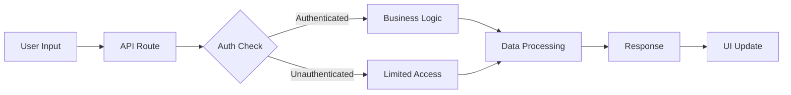

# Next.js Project Planning & Architecture Document

> **Project**: [Your Project Name]
> **Version**: 1.0.0
> **Last Updated**: [Date]

## 1. Project Overview

### 1.1 Mission & Vision
**Mission**: [Describe what your project does and the problem it solves]

**Vision**: [Describe the long-term goal and impact of your project]

### 1.2 Core Values & Principles
- **[Value 1]**: [Description]
- **[Value 2]**: [Description]
- **[Value 3]**: [Description]
- **[Value 4]**: [Description]
- **[Value 5]**: [Description]

### 1.3 Success Metrics
| Metric Category | Key Indicators | Target |
|----------------|----------------|---------|
| User Engagement | [Metric] | [Target] |
| | [Metric] | [Target] |
| Technical Performance | [Metric] | [Target] |
| | [Metric] | [Target] |
| Business Impact | [Metric] | [Target] |
| | [Metric] | [Target] |

## 2. Architecture & System Design

### 2.1 System Architecture Overview

```
┌─────────────────────────────────────────────────────────────┐
│                    Presentation Layer                        │
│  ┌─────────────┐  ┌──────────────┐  ┌──────────────────┐  │
│  │  UI/UX      │  │  Components  │  │  State Mgmt     │  │
│  │  (Next.js)  │  │  (React/TSX) │  │  (Hooks/Context)│  │
│  └─────────────┘  └──────────────┘  └──────────────────┘  │
└─────────────────────────┬───────────────────────────────────┘
                          │
┌─────────────────────────┴───────────────────────────────────┐
│                    Application Layer                         │
│  ┌─────────────┐  ┌──────────────┐  ┌──────────────────┐  │
│  │  API Routes │  │  Middleware  │  │  Business Logic │  │
│  │  (App Router)│  │  (Auth/CORS) │  │  (Services)     │  │
│  └─────────────┘  └──────────────┘  └──────────────────┘  │
└─────────────────────────┬───────────────────────────────────┘
                          │
┌─────────────────────────┴───────────────────────────────────┐
│                    Integration Layer                         │
│  ┌─────────────┐  ┌──────────────┐  ┌──────────────────┐  │
│  │ [Service 1] │  │ [Service 2]  │  │  External APIs  │  │
│  │             │  │              │  │  (REST/GraphQL) │  │
│  └─────────────┘  └──────────────┘  └──────────────────┘  │
└─────────────────────────┬───────────────────────────────────┘
                          │
┌─────────────────────────┴───────────────────────────────────┐
│                    Data Layer                                │
│  ┌─────────────┐  ┌──────────────┐  ┌──────────────────┐  │
│  │  Database   │  │  Cache Layer │  │  File Storage   │  │
│  │  ([Type])   │  │  ([Type])    │  │  ([Type])       │  │
│  └─────────────┘  └──────────────┘  └──────────────────┘  │
└─────────────────────────────────────────────────────────────┘
```

### 2.2 Core Design Patterns

#### 2.2.1 Architectural Patterns

| Pattern | Purpose | Implementation |
|---------|---------|----------------|
| **Layered Architecture** | Separation of concerns | Presentation → Application → Integration → Data |
| **[Pattern]** | [Purpose] | [Implementation] |
| **[Pattern]** | [Purpose] | [Implementation] |

#### 2.2.2 Design Principles

1. **Single Responsibility**: Each module/component has one clear purpose
2. **Open/Closed**: Open for extension, closed for modification
3. **Dependency Inversion**: Depend on abstractions, not concretions
4. **Interface Segregation**: Specific interfaces for specific needs
5. **Don't Repeat Yourself**: Shared utilities and components

### 2.3 Data Flow Architecture



### 2.4 Integration Patterns

#### 2.4.1 [Integration Type]
```typescript
// Example integration pattern
export const serviceIntegration = {
  // Implementation details
};
```

## 3. Technology Stack

### 3.1 Core Framework & Libraries

| Layer | Technology | Version | Purpose | Rationale |
|-------|------------|---------|---------|-----------|
| **Framework** | Next.js | [Version] | Full-stack React framework | [Reason] |
| **Language** | TypeScript | [Version] | Type safety | [Reason] |
| **UI Library** | React | [Version] | Component library | [Reason] |
| **Styling** | [Library] | [Version] | [Purpose] | [Reason] |
| **Components** | [Library] | [Version] | [Purpose] | [Reason] |

### 3.2 Infrastructure & Services

| Service | Provider | Purpose | Configuration |
|---------|----------|---------|---------------|
| **Database** | [Provider] | [Purpose] | [Config] |
| **Cache** | [Provider] | [Purpose] | [Config] |
| **File Storage** | [Provider] | [Purpose] | [Config] |
| **CDN** | [Provider] | [Purpose] | [Config] |
| **Hosting** | [Provider] | [Purpose] | [Config] |

### 3.3 External Dependencies

#### 3.3.1 [Category] Services
| Service | Use Case | API Type | Rate Limits |
|---------|----------|----------|-------------|
| [Service] | [Use Case] | [Type] | [Limits] |

### 3.4 Development Tools

```json
{
  "scripts": {
    "dev": "next dev",
    "build": "next build",
    "start": "next start",
    "lint": "next lint",
    "test": "[test command]"
  }
}
```

## 4. Code Standards & Conventions

### 4.1 Naming Conventions

#### 4.1.1 File Naming
| Type | Pattern | Example | Notes |
|------|---------|---------|-------|
| **Components** | `PascalCase.tsx` | `SearchInput.tsx` | React components only |
| **Utilities** | `kebab-case.ts` | `format-date.ts` | Non-component TS files |
| **Hooks** | `use-kebab-case.ts` | `use-local-storage.ts` | Must start with `use` |
| **API Routes** | `route.ts` | `app/api/search/route.ts` | Next.js convention |
| **Tests** | `*.test.ts(x)` | `utils.test.ts` | Colocated with source |
| **Types** | `types.ts` or `*.types.ts` | `user.types.ts` | Type definitions |

#### 4.1.2 Variable & Function Naming
```typescript
// Constants - UPPER_SNAKE_CASE
const MAX_RETRY_ATTEMPTS = 3;
const API_BASE_URL = 'https://api.example.com';

// Variables - camelCase
const userProfile = { name: 'John' };
let isLoading = false;

// Functions - camelCase
function calculateScore(item: Item): number {
  return item.value * item.weight;
}

// React Hooks - use prefix + PascalCase
function useWindowSize() {
  // Implementation
}

// Event Handlers - handle + Event
const handleSubmit = (e: FormEvent) => {
  e.preventDefault();
};

// Boolean variables - is/has/should prefix
const isAuthenticated = true;
const hasPermission = false;
const shouldRefresh = true;
```

#### 4.1.3 Component Naming
```typescript
// Components - PascalCase
export function SearchResults() { }
export const UserProfile = () => { };

// Component with props - Props suffix for type
interface SearchResultsProps {
  results: Result[];
  onSelect: (result: Result) => void;
}

// Higher-Order Components - with prefix
export const withAuth = (Component: ComponentType) => { };

// Context - Context suffix
export const ThemeContext = createContext();

// Providers - Provider suffix
export function ThemeProvider({ children }: PropsWithChildren) { }
```

#### 4.1.4 Type & Interface Naming
```typescript
// Types - PascalCase, T prefix for generics
type TResponse<T> = {
  data: T;
  error: Error | null;
};

// Interfaces - PascalCase, I prefix optional but consistent
interface IUserProfile {
  id: string;
  name: string;
}

// Enums - PascalCase, singular
enum UserRole {
  Admin = 'ADMIN',
  User = 'USER',
  Guest = 'GUEST'
}

// Type unions - descriptive names
type SearchResult = WebResult | LocalResult | ApiResult;
```

#### 4.1.5 Database Naming
```sql
-- Tables - snake_case, plural
CREATE TABLE users (
  -- Columns - snake_case
  user_id UUID PRIMARY KEY,
  created_at TIMESTAMP,
  email_address VARCHAR(255)
);

-- Indexes - idx_ prefix
CREATE INDEX idx_users_email ON users(email_address);

-- Foreign keys - fk_ prefix
ALTER TABLE posts ADD CONSTRAINT fk_posts_user_id 
  FOREIGN KEY (user_id) REFERENCES users(user_id);
```

### 4.2 File Structure Patterns

#### 4.2.1 Project Structure
```
/
├── app/                      # Next.js App Router
│   ├── (auth)/              # Route groups for authentication
│   ├── (marketing)/         # Public marketing pages
│   ├── (app)/               # Protected app pages
│   ├── api/                 # API routes
│   │   ├── auth/           # Auth endpoints
│   │   └── [resource]/     # Resource endpoints
│   ├── layout.tsx          # Root layout
│   └── providers.tsx       # Client providers
├── components/              # React components
│   ├── ui/                 # Base UI components
│   ├── features/           # Feature-specific components
│   └── shared/            # Shared components
├── lib/                    # Core libraries and utilities
│   ├── db/                # Database layer
│   │   ├── schema.ts     # Database schema
│   │   ├── queries.ts    # Query functions
│   │   └── index.ts      # DB client export
│   ├── utils/            # Utility functions
│   └── validations/      # Zod schemas
├── hooks/                 # Custom React hooks
├── services/             # Business logic services
├── types/                # TypeScript type definitions
├── styles/               # Global styles
├── public/               # Static assets
└── tests/                # Test files (can be colocated)
```

#### 4.2.2 Feature-Based Organization
```
/features/[feature-name]/
├── components/           # Feature-specific components
├── hooks/               # Feature-specific hooks
├── lib/                 # Feature-specific logic
├── types/               # Feature-specific types
└── index.ts            # Public API
```

#### 4.2.3 Component Structure Pattern
```
/components/ComponentName/
├── ComponentName.tsx      # Main component
├── ComponentName.types.ts # Type definitions
├── ComponentName.test.tsx # Tests
├── ComponentName.stories.tsx # Storybook stories
└── index.ts            # Export
```

### 4.3 Component Patterns

#### 4.3.1 Server vs Client Components
```typescript
// Server Component (default)
import { getData } from '@/lib/data';

export async function ServerComponent() {
  const data = await getData();
  return <div>{/* Render data */}</div>;
}

// Client Component
'use client';

import { useState } from 'react';

export function ClientComponent() {
  const [state, setState] = useState();
  return <div>{/* Interactive component */}</div>;
}
```

#### 4.3.2 Composition Pattern
```typescript
// Compound Component Pattern
export function Card({ children }: PropsWithChildren) {
  return <div className="card">{children}</div>;
}

Card.Header = function CardHeader({ children }: PropsWithChildren) {
  return <div className="card-header">{children}</div>;
};

Card.Body = function CardBody({ children }: PropsWithChildren) {
  return <div className="card-body">{children}</div>;
};

// Usage
<Card>
  <Card.Header>Title</Card.Header>
  <Card.Body>Content</Card.Body>
</Card>
```

#### 4.3.3 Custom Hook Pattern
```typescript
// Hook for data fetching and state management
export function useResource<T>(endpoint: string) {
  const [data, setData] = useState<T | null>(null);
  const [loading, setLoading] = useState(false);
  const [error, setError] = useState<Error | null>(null);

  useEffect(() => {
    const fetchData = async () => {
      setLoading(true);
      try {
        const response = await fetch(endpoint);
        const result = await response.json();
        setData(result);
      } catch (err) {
        setError(err as Error);
      } finally {
        setLoading(false);
      }
    };

    fetchData();
  }, [endpoint]);

  return { data, loading, error };
}
```

### 4.4 API Design Standards

#### 4.4.1 RESTful Route Patterns
```
GET    /api/resources          # List resources
GET    /api/resources/:id      # Get single resource
POST   /api/resources          # Create resource
PUT    /api/resources/:id      # Update resource
PATCH  /api/resources/:id      # Partial update
DELETE /api/resources/:id      # Delete resource
```

#### 4.4.2 API Response Format
```typescript
// Success response
{
  "success": true,
  "data": { /* resource data */ },
  "meta": {
    "timestamp": "2025-01-14T12:00:00Z",
    "version": "1.0"
  }
}

// Error response
{
  "success": false,
  "error": {
    "code": "ERROR_CODE",
    "message": "Human-readable message",
    "details": { /* additional context */ }
  }
}

// Paginated response
{
  "success": true,
  "data": [ /* array of resources */ ],
  "pagination": {
    "page": 1,
    "pageSize": 20,
    "totalPages": 5,
    "totalCount": 100
  }
}
```

### 4.5 Database Conventions

#### 4.5.1 Schema Design Patterns
```typescript
// Base schema with common fields
export const baseSchema = {
  id: uuid('id').primaryKey().defaultRandom(),
  createdAt: timestamp('created_at').notNull().defaultNow(),
  updatedAt: timestamp('updated_at').notNull().defaultNow(),
};

// Soft deletes
export const softDeleteSchema = {
  ...baseSchema,
  deletedAt: timestamp('deleted_at'),
};

// Audit fields
export const auditSchema = {
  ...baseSchema,
  createdBy: uuid('created_by').references(() => users.id),
  updatedBy: uuid('updated_by').references(() => users.id),
};
```

## 5. Development Workflow

### 5.1 Environment Setup

#### 5.1.1 Prerequisites
```bash
# Required software
node >= 20.0.0
npm/yarn/pnpm >= [version]
git >= 2.0.0

# Optional but recommended
docker >= 20.0.0  # For containerized development
```

#### 5.1.2 Initial Setup
```bash
# Clone repository
git clone [repository-url]
cd [project-name]

# Install dependencies
[package-manager] install

# Copy environment variables
cp .env.example .env.local

# Setup database (if applicable)
[database-setup-command]

# Start development server
[package-manager] dev
```

#### 5.1.3 Environment Variables
```bash
# Core Configuration
NODE_ENV=development
NEXT_PUBLIC_APP_URL=http://localhost:3000

# Database
DATABASE_URL=

# Authentication
[AUTH_VARIABLES]

# External Services
[SERVICE_API_KEYS]
```

### 5.2 Development Process

#### 5.2.1 Branch Strategy
```
main
├── develop
│   ├── feature/[feature-name]
│   ├── bugfix/[bug-description]
│   └── refactor/[refactor-description]
├── hotfix/[critical-fix]
└── release/[version]
```

#### 5.2.2 Commit Conventions
```bash
# Format: type(scope): description

# Types
feat     # New feature
fix      # Bug fix
docs     # Documentation only
style    # Code style changes
refactor # Code refactoring
perf     # Performance improvements
test     # Test additions/changes
chore    # Build process or auxiliary tool changes

# Examples
feat(auth): add social login
fix(api): resolve timeout issue
docs(readme): update setup instructions
```

#### 5.2.3 Code Review Checklist
- [ ] Code follows naming conventions
- [ ] TypeScript types are properly defined
- [ ] No `any` types or `@ts-ignore`
- [ ] Error handling is implemented
- [ ] Tests are written/updated
- [ ] Documentation is updated
- [ ] Performance impact considered
- [ ] Security implications reviewed
- [ ] Accessibility requirements met

### 5.3 Build & Deployment

#### 5.3.1 Build Process
```bash
# Development build
[package-manager] dev

# Production build
[package-manager] build

# Type checking
[package-manager] typecheck

# Linting
[package-manager] lint

# Testing
[package-manager] test
```

#### 5.3.2 Deployment Stages
| Stage | Branch | URL | Purpose |
|-------|--------|-----|---------|
| Development | feature/* | dev.[domain] | Feature testing |
| Staging | develop | staging.[domain] | Integration testing |
| Production | main | [domain] | Live application |

### 5.4 Version Control

#### 5.4.1 Git Workflow
```bash
# Feature development
git checkout -b feature/new-feature
git add .
git commit -m "feat: implement new feature"
git push origin feature/new-feature

# Create pull request
[pr-creation-process]
```

## 6. Feature Architecture

### 6.1 Core Features

#### 6.1.1 [Feature Category]
| Feature | Description | Components | API Endpoints |
|---------|-------------|------------|---------------|
| [Feature] | [Description] | [Components] | [Endpoints] |

### 6.2 Feature Implementation Patterns

#### 6.2.1 [Pattern Name]
```typescript
// Pattern implementation example
```

### 6.3 Extension Points

#### 6.3.1 Adding New Features
1. [Step 1]
2. [Step 2]
3. [Step 3]

## 7. Data Management

### 7.1 Database Design

#### 7.1.1 Schema Architecture
```typescript
// Example schema
export const users = pgTable('users', {
  id: uuid('id').primaryKey().defaultRandom(),
  email: varchar('email', { length: 255 }).notNull().unique(),
  createdAt: timestamp('created_at').notNull().defaultNow(),
});
```

#### 7.1.2 Data Access Patterns
```typescript
// Repository pattern example
export class UserRepository {
  async findById(id: string) {
    // Implementation
  }
}
```

### 7.2 Caching Strategy

#### 7.2.1 Cache Layers
| Layer | Technology | Purpose | TTL |
|-------|------------|---------|-----|
| Browser | [Type] | [Purpose] | [TTL] |
| Application | [Type] | [Purpose] | [TTL] |
| Database | [Type] | [Purpose] | [TTL] |

### 7.3 State Management

#### 7.3.1 Client State Patterns
```typescript
// State management example
```

## 8. Security & Compliance

### 8.1 Authentication & Authorization

#### 8.1.1 Authentication Flow
[Describe authentication flow]

#### 8.1.2 Authorization Levels
| Level | Description | Access |
|-------|-------------|--------|
| [Level] | [Description] | [Access] |

### 8.2 Data Protection

#### 8.2.1 Security Measures
- Input validation
- XSS prevention
- SQL injection prevention
- [Other measures]

#### 8.2.2 Encryption Standards
- **At Rest**: [Standard]
- **In Transit**: [Standard]
- **Passwords**: [Standard]
- **Tokens**: [Standard]

### 8.3 Compliance Requirements

#### 8.3.1 [Compliance Type]
| Regulation | Requirement | Implementation |
|------------|-------------|----------------|
| [Regulation] | [Requirement] | [Implementation] |

## 9. Performance & Scalability

### 9.1 Performance Standards

#### 9.1.1 Performance Metrics
| Metric | Target | Measurement |
|--------|--------|-------------|
| First Contentful Paint | [Target] | [Tool] |
| Time to Interactive | [Target] | [Tool] |
| API Response Time | [Target] | [Tool] |

### 9.2 Optimization Strategies

#### 9.2.1 Code Optimization
```typescript
// Optimization examples
```

### 9.3 Scaling Patterns

#### 9.3.1 Horizontal Scaling Architecture
[Describe scaling architecture]

## 10. Testing & Quality Assurance

### 10.1 Testing Strategy

#### 10.1.1 Test Types
| Type | Purpose | Tools | Coverage Target |
|------|---------|-------|-----------------|
| Unit | [Purpose] | [Tools] | [Target] |
| Integration | [Purpose] | [Tools] | [Target] |
| E2E | [Purpose] | [Tools] | [Target] |

#### 10.1.2 Test Structure
```typescript
// Test example
describe('Component', () => {
  it('should behave correctly', () => {
    // Test implementation
  });
});
```

### 10.2 Quality Standards

#### 10.2.1 Code Quality Metrics
```json
{
  "eslintConfig": {
    "extends": ["next/core-web-vitals"],
    "rules": {
      // Custom rules
    }
  }
}
```

## 11. API & Integration Documentation

### 11.1 API Design Principles
[List API design principles]

### 11.2 Integration Patterns

#### 11.2.1 External Service Integration
```typescript
// Integration pattern example
```

## 12. Operational Guidelines

### 12.1 Deployment Process

#### 12.1.1 Deployment Pipeline
[Describe deployment pipeline]

### 12.2 Monitoring & Logging

#### 12.2.1 Logging Strategy
```typescript
// Logging example
```

#### 12.2.2 Monitoring Stack
- **APM**: [Tool]
- **Error Tracking**: [Tool]
- **Uptime**: [Tool]
- **Logs**: [Tool]

### 12.3 Incident Response

#### 12.3.1 Severity Levels
| Level | Response Time | Example |
|-------|---------------|---------|
| P0 - Critical | [Time] | [Example] |
| P1 - High | [Time] | [Example] |
| P2 - Medium | [Time] | [Example] |
| P3 - Low | [Time] | [Example] |

## 13. Project Roadmap

### 13.1 Current Status

#### 13.1.1 Completed Features
- ✅ [Feature]
- ✅ [Feature]

#### 13.1.2 In Progress
- 🔄 [Feature]
- 🔄 [Feature]

### 13.2 Future Milestones

#### 13.2.1 [Time Period]
| Feature | Priority | Effort |
|---------|----------|--------|
| [Feature] | [Priority] | [Effort] |

### 13.3 Technical Debt

#### 13.3.1 Current Debt Items
| Item | Impact | Priority | Estimated Effort |
|------|--------|----------|------------------|
| [Item] | [Impact] | [Priority] | [Effort] |

## Appendices

### A. Quick Reference Guide

#### A.1 Common Commands
```bash
# Development
[command]              # [Description]

# Testing
[command]              # [Description]

# Deployment
[command]              # [Description]
```

#### A.2 Environment Variables Template
```env
# Copy to .env.local and fill in values

# Core
NODE_ENV=development
NEXT_PUBLIC_APP_URL=http://localhost:3000

# Add your variables here
```

#### A.3 Project Structure
```
[project-name]/
├── app/                  # Next.js app directory
├── components/           # React components
├── lib/                  # Core libraries
├── hooks/                # Custom hooks
├── services/             # Business logic
├── types/                # TypeScript types
├── public/               # Static assets
├── tests/                # Test files
└── docs/                 # Documentation
```

---

This planning document serves as the comprehensive guide for [Your Project Name]'s architecture, development practices, and future direction. It should be updated regularly as the project evolves and new patterns emerge.

**Document Maintenance**: Review quarterly, update as needed, version control all changes.